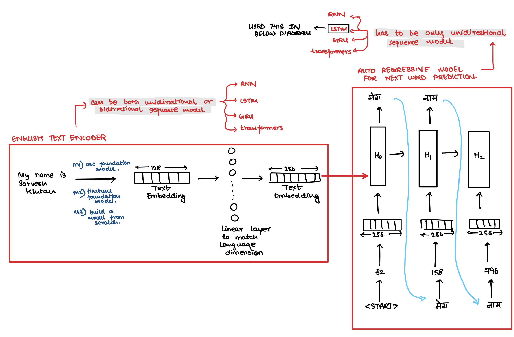
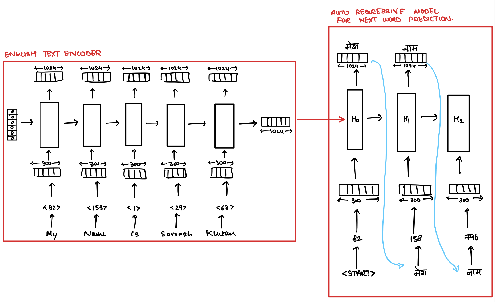

# Machine Translation (MT)

- Translating a language A to language B is called monolingual machine translation system eg english to hindi.

- There are many ways to solve MT problems but we will use similar techniques to what we used to solve [Image2Text](https://pub.towardsai.net/natural-language-generation-x2text-tasks-78641031b033#1341) Problem i.e. Deep Learning / Neural Machine Translation (NMT) just that this time we will condition the language model on another text information rather than image information.

- Following is the architecture diagram wherein we train the engligh text encoder from scratch

- Code for above architecture is available [here](https://github.com/khetansarvesh/NLP/blob/main/unitask_downstream_nlp/Machine-Translation/machine_translation.ipynb)
